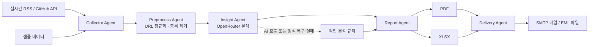

# TechLab Daily Insight Demo

중간 산출물의 Agent 구조를 실행 가능한 데모로 구현한 로컬 앱이다.

## 전체 구조



| 구성 요소 | 역할 |
| --- | --- |
| Collector Agent | 설정된 RSS와 GitHub API에서 공개 기술 정보를 수집하고 소스별 실행 로그를 남긴다. |
| Preprocess Agent | 필수 필드를 확인하고 URL 추적 파라미터 제거, 정규화, 중복 제거를 수행한다. |
| Insight Agent | OpenRouter 모델로 기사 요약, 분류, 키워드, 중요도와 실무 적용 포인트를 생성한다. |
| Report Agent | 중요도 순으로 Top-N을 선정해 PDF, XLSX, 실행 로그 JSON을 생성한다. |
| Delivery Agent | 생성된 보고서를 SMTP로 발송하거나 메일 클라이언트에서 열 수 있는 EML 파일로 만든다. |
| 백업 분석 규칙 | 무료 모델의 호출 제한이나 JSON 형식 오류가 발생해도 데모와 보고서 생성을 계속한다. |

실행 결과와 중간 데이터는 실행 시각별로 `outputs/YYYYMMDD_HHMMSS/`에 저장되며,
Streamlit 화면의 `Raw / Clean`, `AI Insight`, `PDF / XLSX` 탭에서 단계별 결과를
확인할 수 있다.

## 1. 가장 빠른 실행

프로젝트 디렉터리에서 다음 명령을 실행한다.

```bash
chmod +x scripts/run_demo.sh
./scripts/run_demo.sh
```

최초 실행 시 가상환경과 필요한 패키지를 자동으로 설치한 뒤 브라우저에서
`http://localhost:8501`을 연다.

앱 왼쪽의 `OpenRouter API Key` 입력란에 키를 붙여 넣고
`전체 파이프라인 실행`을 누르면 된다. 기본 모델은 무료 모델을 자동 선택하는
`openrouter/free`다.

## 2. Key를 파일에 저장하는 방법

프로젝트 루트의 `.env` 파일에서 아래 한 줄의 등호 뒤에 키를
입력하면 실행 화면에 자동 반영된다.

```dotenv
OPENROUTER_API_KEY=sk-or-v1-여기에_발급받은_Key
```

특정 무료 모델을 고정하려면 OpenRouter 모델 ID의 `:free` 변형을 지정한다.

```dotenv
OPENROUTER_MODEL=openrouter/free
```

무료 모델은 가용성과 호출 한도가 달라질 수 있다. 이 데모는 한 번 실행할 때
여러 기사를 한 요청으로 분석해 호출 수를 줄였다. OpenRouter 공식 문서:

- https://openrouter.ai/docs/guides/routing/routers/free-router
- https://openrouter.ai/docs/quickstart

## 3. 데모 실행 순서

1. 기본값인 `실시간 수집`으로 실행해 실제 공개 원문 링크를 확인한다.
2. `샘플 데이터`는 외부 수집 없이 화면과 출력물을 빠르게 확인할 때 사용한다.
3. `Raw / Clean` 탭에서 URL 정규화와 중복 제거 전후를 비교한다.
4. `AI Insight` 탭에서 요약, 중요도, 카테고리, 실무 적용 포인트를 확인한다.
5. `PDF / XLSX` 탭에서 최종 PDF를 미리 보고 내려받는다.
6. `메일 발송` 탭에서 SMTP 설정 후 본인 주소로 PDF를 발송한다.

외부 사이트나 무료 모델이 일시적으로 실패해도 `AI 실패 시 백업 결과 사용`을
선택하면 저장된 샘플과 백업 규칙으로 영상 촬영을 이어갈 수 있다. 실행 결과는
`outputs/YYYYMMDD_HHMMSS/`에 저장된다.

`샘플 데이터`는 파이프라인 동작 확인을 위한 합성 데이터다. `example.com` 주소는
실제 기사가 아니므로 앱, PDF, 이메일에서는 원문 링크 대신 샘플임을 표시한다.

## 4. 이메일 설정

발신자와 수신자는 기본적으로 모두 아래 주소로 설정되어 있다.

```text
jongeunshin95@kbfg.com
```

OpenRouter Key는 AI 호출에만 사용되며 이메일 발송 권한은 제공하지 않는다.
실제 메일 발송에는 회사에서 허용한 SMTP 서버 정보가 필요하다. 앱의
`메일 발송` 탭에서 입력하거나 `.env`에 설정한다.

```dotenv
EMAIL_FROM=jongeunshin95@kbfg.com
EMAIL_TO=jongeunshin95@kbfg.com
SMTP_HOST=회사에서_안내받은_SMTP_주소
SMTP_PORT=587
SMTP_USERNAME=SMTP_로그인_계정
SMTP_PASSWORD=SMTP_비밀번호_또는_앱_비밀번호
SMTP_SECURITY=starttls
```

사내 SMTP Relay가 인증 없이 허용되는 환경이라면 `SMTP_USERNAME`과
`SMTP_PASSWORD`를 비워 둘 수 있다. Microsoft 365를 사용하는 경우 일반적으로
`smtp.office365.com:587`과 STARTTLS를 사용하지만, 조직 정책에서 SMTP AUTH가
차단되어 있을 수 있으므로 사내 메일 관리자 확인이 필요하다.

SMTP를 바로 사용할 수 없는 경우 `EML 파일 다운로드`로 첨부 파일과 HTML 본문이
포함된 메일 파일을 만든 뒤 승인된 메일 클라이언트에서 열 수 있다.

Gmail에서 발송할 때는 `smtp.gmail.com`, 포트 `587`, 보안 `starttls`를 사용하고
SMTP Username에는 전체 Gmail 주소, SMTP App Password에는 Google 계정에서
발급한 16자리 앱 비밀번호를 입력한다. 사내 네트워크가 외부 SMTP 포트를 차단하면
연결이 강제로 종료될 수 있으므로 다른 네트워크에서 실행하거나 PDF를 내려받아
Gmail 웹에서 직접 첨부한다.

## 5. PDF만 생성

화면 없이 샘플 PDF와 XLSX를 생성하려면 다음 명령을 실행한다.

```bash
.venv/bin/python scripts/generate_sample.py
```

`.env`에 OpenRouter Key가 있으면 실제 AI 분석을 사용하고, 없으면 백업 규칙으로
PDF를 생성한다.

## 6. 보안 유의사항

- `.env`는 버전 관리에서 제외되어 있다.
- 외부 무료 모델에는 공개 데이터만 전송한다.
- 사내 문서, 개인정보, 고객정보, 인증정보를 Prompt나 수집 데이터에 넣지 않는다.
- AI 요약은 최종 사실 확인 수단이 아니므로 원문 URL과 함께 검수한다.
- 실제 메일 발송과 사내 반입은 조직의 보안 정책 및 승인 절차를 따른다.

## 7. 무료 모델 429 오류

무료 모델의 공용 호출 한도가 일시적으로 소진되면 429 응답이 발생할 수 있다.
앱은 현재 사용 가능한 무료 모델을 조회한 뒤 다음 순서로 자동 복구한다.

1. 입력한 모델 또는 `openrouter/free`로 요청한다.
2. 429, 502, 503 응답이면 다른 공급자의 무료 모델로 전환한다.
3. 요청별 최대 45초, 최대 2회 시도 후에도 실패하면
   `AI 실패 시 백업 결과 사용` 설정에 따라
   백업 규칙으로 PDF 생성을 계속한다.
4. 모델이 설명문이나 깨진 JSON을 반환하면 JSON 객체 출력을 한 번 자동 복구한다.
5. JSON Schema 지원 공급자만 사용하고 OpenRouter의 Response Healing을 적용한다.

429가 반복되면 백업 설정을 선택한 상태로 실행하거나 잠시 후 다시 시도한다.

- https://openrouter.ai/docs/guides/routing/model-fallbacks
- https://openrouter.ai/docs/api/reference/errors-and-debugging
